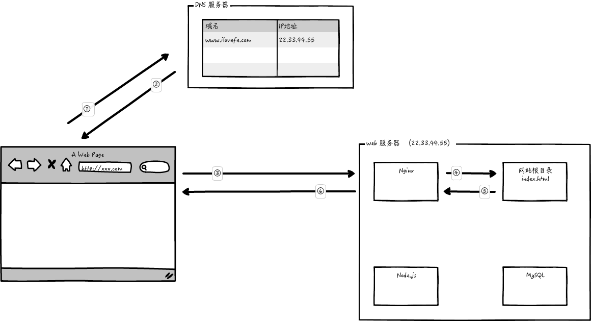
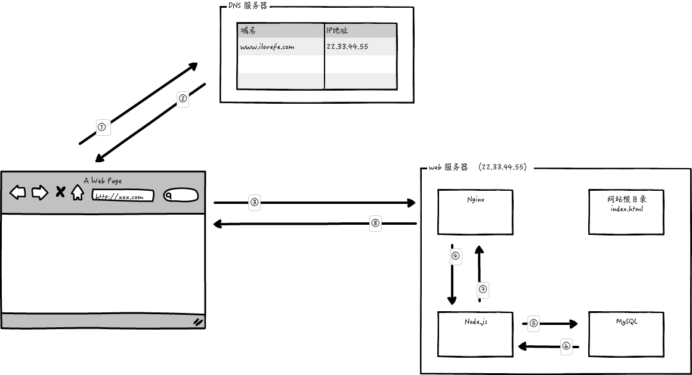
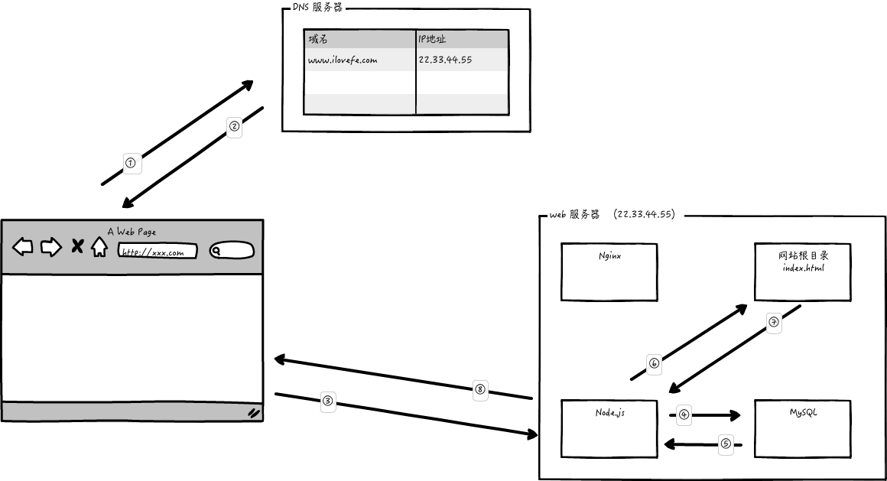

# 网站上线部署课程


> **同学们的疑问：**
>
> * 用户是怎么访问到的我们开发好的网站的？
> * 我们的项目开发完毕之后是怎么上线的？
> * 实际开发过程当中，项目上线的活儿要前端程序员来做吗？

## 一、网站运行机制

### 1. 名词解释

#### 域名

> * www.baidu.com
> * www.taobao.com
> * www.qq.com

> 域名俗称网址，是由一串用点分隔的名字组成，用于标识互联网上的计算机。
>
> 原本用于标识互联网上计算机使用的是 IP 地址，但是由于 IP 地址不便于记忆，所以人们便设计出来比较容易记忆的域名，然后通过 DNS 将域名和 IP 地址关联，这样人们便可以通过记忆域名直接访问到对应的计算机。

#### DNS 服务器

> DNS (Domain Name System)，可以理解为互联网上的一项服务，他可以将域名转换成其对应的 IP 地址。
>
> 可以将其理解为字典，字典中存储的就是域名和 IP 地址一一对应的键值对。
>
> 本地 hosts 文件
>
> windows: c:\windows\system32\drivers\etc\hosts
>
> mac: /etc/hosts

#### 服务器

> 服务器其实就是一台计算机，但是这台计算机并和我们自己的的 PC 不一样，不是日常使用的，而是提供某项互联网服务的。
>
> 比如 web 服务器，能为我们提供网页服务，email 服务器，能为我们提供电子邮件服务，FTP 服务器能为我们提供文件存储服务等等。
>
> 为计算机安装不同的服务应用程序，即可提供相应的服务。
>
> 常见的web 服务应用程序： Apache、Nginx、IIS、Node.js


### 2. 网站请求流程（简化版）

#### 静态页面

网页只请求和响应简单的 HTML、CSS、JavaScript 文件，未和服务端进行任何数据通信。这样的页面叫做静态页面。

#### 动态页面

页面内有和服务器进行数据通信，这样的页面叫做动态页面。

#### 前后端分离的页面

> 前后端分离的项目中，页面中的数据渲染是在浏览器中完成的。

前后端分离的页面请求分为两部分： 静态页面请求 + ajax 数据请求






#### 前后端不分离的页面

> 前后端不分离的项目中，页面中的数据渲染操作是在服务器端完成的。

前后端不分离的页面一次请求就能完成。



## 二、网站上线部署流程

### 1. 服务器购买

国内服务器： 阿里云 ECS(Elastic Compute Service)，腾讯云 CVM(Cloud Virtual Machine) 等

国外服务器： 日本 [Vultr](https://www.vultr.com/), 美国 Linode, 谷歌云，微软 Azure，亚马逊 AWS 等

这一步需要创建好服务器实例，分配好外网 IP 地址。

### 2. 域名购买

国内： 万网（阿里）、腾讯等

国外： Godaddy

### 3. 域名解析（配置 DNS）

注册好域名之后需要将域名映射到自己服务器对应的 IP 地址，这样别人才能通过域名访问到我们的服务器。

这个步骤叫做域名解析，通过域名服务商提供的后台就可以操作，一般域名解析都会有延迟，不是即时生效的。

### 4. 服务器环境搭建

配置服务器，Mac 系统下直接用终端就ok

windows下需要用到 git bash, 或者别的工具（Putty）

需要用到的 Linux 系统操作命令

```shell
# 远程连接命令
ssh root@域名

# 展示当前文件夹路径
pwd

# 切换文件夹目录
cd 目录路径

# 展示当前文件夹中内容
ls

# 编辑文件
vim 文件路径

# 传输文件 
scp 本地文件路径 root@域名:远程路径

# 解压文件命令
unzip 
```

#### 4.1 安装 CentOS 开发人员相关包

```shell
yum groupinstall 'Development tools'
```

#### 4.2 配置免密登陆

```shell
# 在自己电脑上 生成本地 秘钥对
ssh-keygen -t rsa 

# 生成的位置
# mac 在 ~/.ssh
# windows 在 C:\users\你的用户名\.ssh

# 在服务器创建了一个.ssh 文件夹
mkdir .ssh

# 切换到这个文件夹
cd .ssh

# 创建了一个文件
touch authorized_keys

# 我们把自己电脑上的 id_rsa.pub 文件中的内容 放到 authorized_keys文件中
echo "cqHuvyGI2EXH5EOT/wsjIlNqH6kRaGRzLOcYAoYyn+0nsPhEfFOkv1cii9Ax9naeJuw78LapaXxmGgkcBWdk2W1KXkL5tPIZUIZAfwJ4PihDQ+0rUj5Yar741NvZYNYZ+xa1RBeziR3gbwdTLPV22Et9TTiLVEY0bNXxgvI1GGvT87f+sFB5hEB0HyQpDFyjDN+UyxTKf/Zf/7Z2z/Qz2kWTFI6oaCNfScdhjEUO8qzSsjR+9X5hE6dxmz8EII0jvAumnBy0kcIv9BaQ6TCQrijh0TWWkih2HRq8prmBzCWxb3a2A/f9PM+E6kdDBZ9lJTgB4ww8IQDxVXxhg5B14pR7ULA0rpT4ITPNFzzkVt5mo2m1bF0VH3HFiJWATaLCHZoKm8Qij6LbDL20dr4StE4zJ2fEKhi7c4CU= Ryan@panmings-MBP.lan" >> authorized_keys

# 退出服务器，下次直接就能免密登陆了
exit
```

#### 4.3 安装Nginx

```shell
# 添加 Nginx 源
sudo yum install epel-release
# 安装 Nginx
sudo yum install nginx
# 启动 Nginx
nginx
# 配置防火墙规则
sudo firewall-cmd --permanent --zone=public --add-service=http 
sudo firewall-cmd --permanent --zone=public --add-service=https
sudo firewall-cmd --reload
```

#### 4.4 安装Node.js

```shell
# yum自带源中没有Node.js,所以首先要获取Node.js资源：
curl --silent --location https://rpm.nodesource.com/setup_14.x | bash -

# 安装 Node.js
yum install -y nodejs

# 安装完成之后使用如下指令测试安装是否成功
node -v

# 安装pm2 node.js程序管理工具
npm i pm2 -g

# 使用pm2 启动node.js项目
pm2 start 文件名

# 停止
pm2 stop 文件名或者id

# 从pm2的管理列表中删除
pm2 delete 文件名或者id
```

#### 4.5 安装MySQL
```shell
# 下载并安装 MySQL 源
wget https://dev.mysql.com/get/mysql80-community-release-el7-3.noarch.rpm
sudo yum localinstall mysql80-community-release-el7-3.noarch.rpm

# 安装 MySQL
sudo yum install mysql-community-server -y

# 如果上一步报错 执行下面的语句 之后 再次执行一下上面的安装Mysql的语句
sudo yum module disable mysql

# 启动MySQL
sudo systemctl start mysqld

# 找到默认密码
# MySQL安装完毕之后会自动设置一个默认密码，我们需要找到默认密码
grep 'temporary password' /var/log/mysqld.log

# 连接到MySQL数据库，修改密码
mysql -uroot -p

ALTER USER 'root'@'localhost' IDENTIFIED BY 'Duyi_666duyi';
```


### 5. 上传网站资源

可以使用 `scp` 命令，也可以安装 FTP （vsftpd）工具。

```shell
scp 本地文件 root@域名:远程路径

# 在服务器创建文件夹
mkdir /home/nginx/

# 把网页文件移动到创建好的文件夹里
mv ./dist.zip /home/nginx/

# 解压压缩文件
cd /home/ningx
unzip ./dist.zip

# 修改文件夹名字
mv dist ilovefe
# 结果就是  /home/nginx/ilovefe  这个文件夹中放的就是我们的网页文件了
```


### 6. 配置Nginx

创建一个ilovefe.conf文件

```shell
cd /etc/nginx/conf.d
# 创建配置文件
touch ilovefe.conf
vim ilovefe.conf
# 按i键 进出插入模式
# 复制下面的内容，粘贴进去
# 保存退出
# 按一下esc退出编辑模式
# 然后输入 下面的内容 敲回车
:wq
```


ilovefe.conf

```configure
server {
    listen       80;
    server_name  ilovefe.com;

    location / {
        root   /home/nginx/ilovefe;
        index  index.html index.htm;
    }
    
}
```


### 7. 接口项目部署步骤

1. 修改配置文件中的 mysql 数据库密码

2. 上传项目压缩文件到服务器

3. 在服务器上解压项目文件到 /home/nginx/ilovefeadmin

4. 为项目安装依赖项 npm i

5. 修改mysql数据库 密码规则

   ```mysql
   use mysql;
   ALTER USER 'root'@'localhost' IDENTIFIED BY 'Duyi_666duyi' PASSWORD EXPIRE NEVER;
   ALTER USER 'root'@'localhost' IDENTIFIED WITH mysql_native_password BY 'Duyi_666duyi';
   
   # 查看是否已经修改成功
   select user,host,plugin from user where user='root'; 
   ```

6. 创建新的数据库

   ```mysql
   create database vuesql;
   ```

7. 在之前的nginx配置文件中添加反向代理的配置：

```
 location ^~ /api/ {
  		rewrite  ^/api/(.*)$ /$1 break;
    	proxy_pass  http://127.0.0.1:3000;
 }
```


ilovefeamdin.conf

```
server {
    listen       80;
    server_name  admin.ilovefe.com;
    
    location / {
    	proxy_pass  http://127.0.0.1:3000;
		}
}
```
